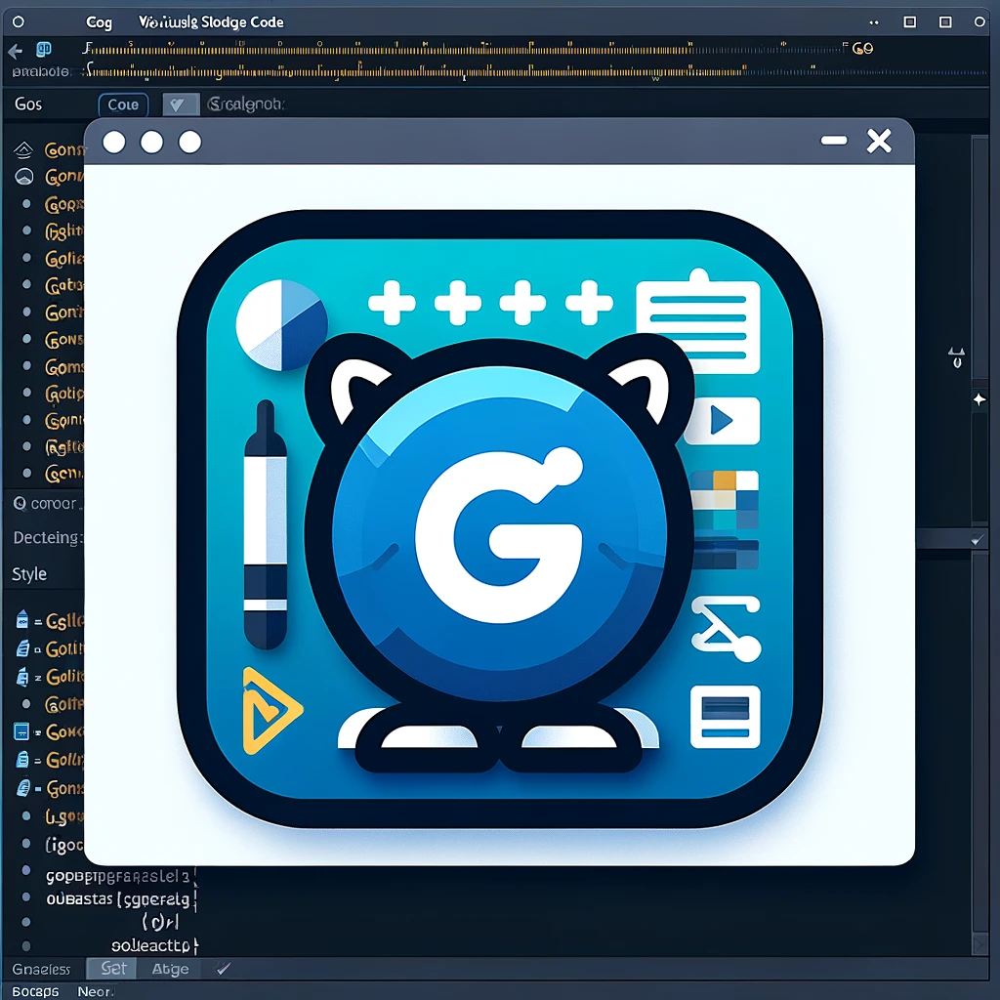

# VS Code Go Version Manager (GVM) Extension

## Overview

This Visual Studio Code extension allows users to seamlessly switch between different Go versions managed by GVM (Go Version Manager). It updates the `go.goroot` and `go.gopath` settings in VS Code based on the selected Go version from the gvm list.

## Features

* Easy integration with GVM.
* Quick selection of Go versions directly from VS Code.
* Automatic update of `go.goroot` and `go.gopath` workspace settings.

## Usage

1. Open the Command Palette (Ctrl+Shift+P or Cmd+Shift+P on macOS).
2. Type and select Select Go Version from the list of commands.
3. A dropdown will appear with the list of installed Go versions (as per gvm list).
4. Select the desired Go version. The extension will automatically update the go.goroot and go.gopath settings for the workspace.

## Contributing

Contributions to the extension are welcome! Please feel free to fork the repository, make changes, and create a pull request.

## Author
Alon Nativ [@anativ](https://github.com/anativ)